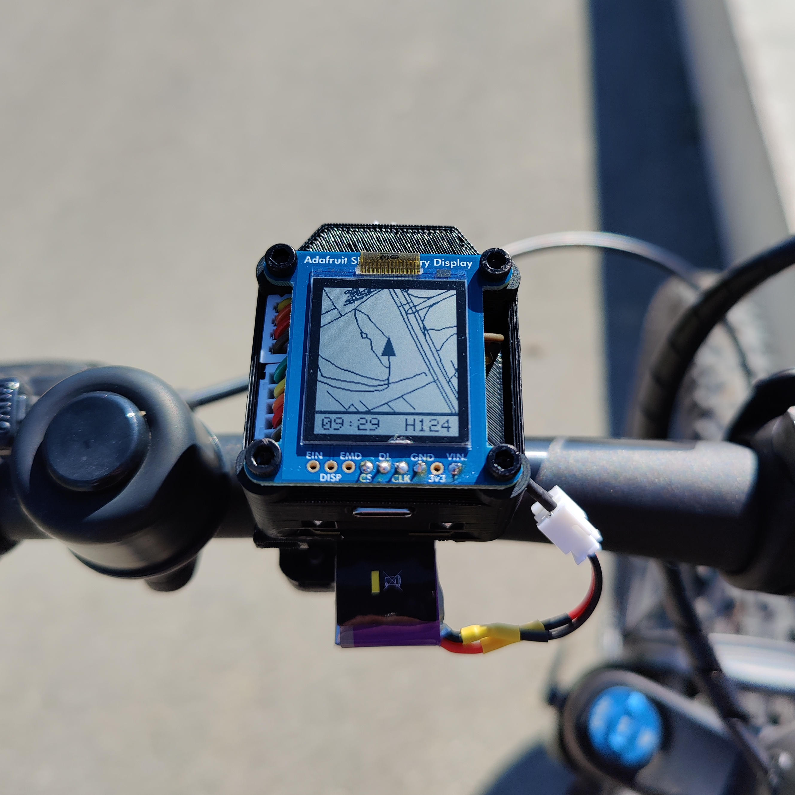

# ESP32-based mini-map for biking

A simple mini-map based on an ESP32C3 for cycling. Renders a map based on the current position and optionally overlays a GPX-track. Featuring OSM-based offline maps with multi-constellation GNSS-positioning and GPX-track rendering.

**DISCLAIMER:** This is a hobby project which lacks documentation, clean code and unit tests.

 


Even though the GIF is low-framerate, the ESP can easily render the map at 60 FPS if the currently shown part of the map isn't too busy.

The motivation behind this project was to create a cheap (~50€) device that displays a komoot gpx track as an overlay over a map for cycling. It has to work without a smartphone, be readable in direct sunlight and last a couple of hours in terms of battery.

## Project structure
```
hardware            Contains instructions/sources/files to build the physical device
software            Software to convert maps, view exported maps and the embedded code for the ESP
software/cpp        Tool to convert OSM maps to an optimized format for the ESP
software/python     Utilities to inspect converted maps and/or get familiar with the map layout
software/esp32      Firmware for the ESP32
```

## Building instructions
### Building the hardware
A wiring diagram, sourcing-list and a .STEP file of the whole assembly can be found in the **hardware** folder. Please refer to the STEP file for assembling the device.

For the 3D-Printed parts (**hardware/STL**), I recommend the following print settings:
|Settings|Value|
|---|---|
|Wall count|4|
|Top/Bottom Layers|4|
|Layer Height|0.2mm|
|Material|ABS/ASA|
|Infill|40%|
|Support|Yes|

My device is printed out of PLA+ but ASA/ABS is the better choice for this application.

### Creating a map
Follow the instructions in **software/cpp/README.MD** to compile the conversion tool and create a map binary.

### Preparing the SD-Card
1. Format the SD-Card as FAT32.
2. Place the map as **map.bin** in the root folder of the SD-Card
3. (Optional) Place the GPX-track as **track.gpx** in the root folder of the SD-Card

### Flashing the firmware
1. Install Visual Studio Code
2. Install the Platform.io extension for Visual Studio Code
3. Open the Platform.io project **software/esp32/esp32c3-bike-companion-32**
4. Have a look at the **main.cpp**. You may need to fix a bug in one of the libraries for the SDCard-Reader.
5. Connect your Seeed ESP32C3 to your PC
6. Flash the firmware

## Usage
All you need to do is mount the device to your bike and connect it to a power source.

The device will automatically power on. It does a small self check on boot and then enters fixing mode, where it remains until it receives a valid position fix from the GNSS module. The map with the current position is only rendered if there is a valid position fix, otherwise it will show "Fixing...".

## CAD Credits
The 3D-models for the ESP32C3 are from GrabCAD:

|Model|Author|Link|
|---|---|---|
|ESP32C3|[Maurice Pannard](https://grabcad.com/maurice.pannard-1)|[Source](https://grabcad.com/library/seeed-studio-xiao-esp32-c3-1)|